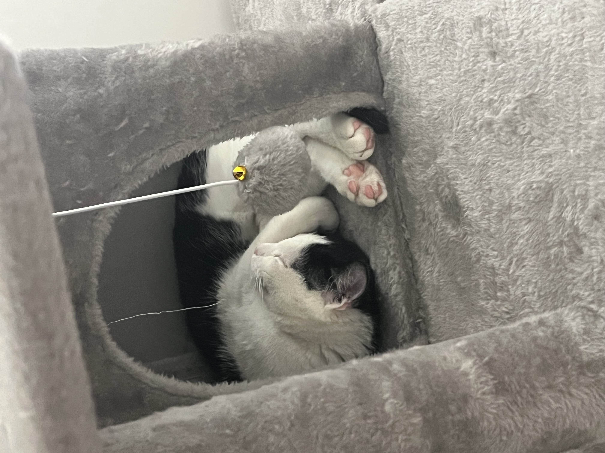

# Exercise1

## Meine Katze

>**Steckbrief:**\
 *Name*: Gatze\
 *Rasse*: Europäische Kurzhaar\
 *Geburtstag*: 14. Juni 2023\
*Adoption*: 13. Oktober 2023

## Katzen im Allgemeinen
Die Katzen (**Felidae**) sind eine Familie aus der Ordnung der Raubtiere (**Carnivora**) innerhalb der Überfamilie der Katzenartigen (**Feloidea**).

Sie sind auf allen Kontinenten außer in den Polarregionen und Australasien und Ozeanien verbreitet, wobei die domestizierte Hauskatze durch den Menschen auch in diese Regionen vorgedrungen ist. 

Eingeteilt werden sie in Großkatzen wie beispielsweise Löwe, Tiger und Leopard und Kleinkatzen wie Wildkatze, Luchs und Ozelot, wobei zu den Kleinkatzen auch große Vertreter wie der Puma und der Gepard gehören. Fossil sind die Katzen vor allem durch die zu ihnen gehörenden Säbelzahnkatzen bekannt, die ältesten Katzenfunde sind etwa 30 Millionen Jahre alt.

Mit der von der afrikanischen Falbkatze abstammenden Hauskatze wurde ein Vertreter der Familie durch Domestizierung zu einem weltweit gehaltenen Haustier. Katzen sind nahezu ausschließlich Fleischfresser und aktive Jäger. Im Erscheinungsbild und im Verhalten sind sich die meisten der heute lebenden Katzenarten sehr ähnlich.

Quelle: [Wikipedia](https://de.wikipedia.org/wiki/Katzen)