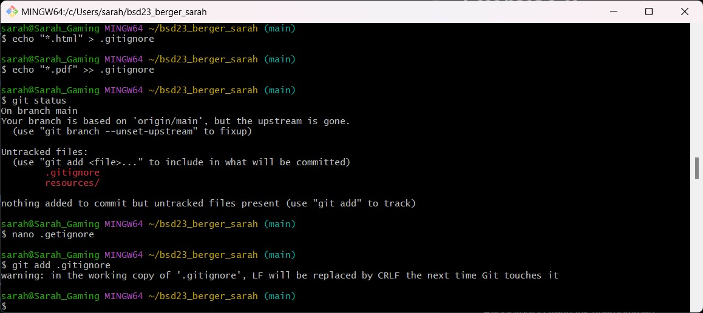
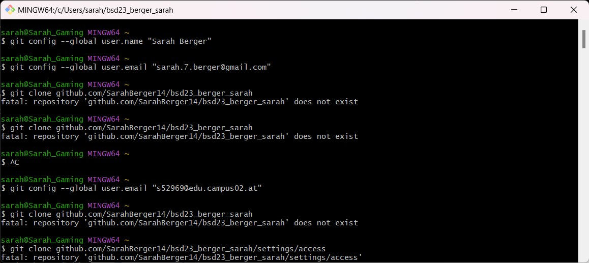

# Exercise 2

## Git Befehle im Überblick
Nun werden die Git Befehle erklärt, welche im Aufgabenblatt stehen.

**git add**
* Ein Ordner bzw. eine Datei wird in den Stating-Bereich hinzugefügt. 
* Gilt auch für mehrere Dateien in einem Verzeichnis inklusive Unterordner. Dies funktioniert mit *git add .*.
* Dieser Bereich ist für die Zwischenspeicherung der Änderungen da. 

**git commit**
* Dieser Schritt passiert, nach *git add*.
* Hier wird der Order bzw. das Dokument dauerhaft in die lokale Repository-Datenbank übernommen.
* Es muss eine Commit-Nachricht verfasst werden, wo die Änderung beschrieben wird.
>git commit -m "..."

**.gitignore**
* Dies ist eine Konfigurationsdatei.
* Es werden zuvor festgelegte Ordner, Dateien, Verzeichnisse oder Muster ausgeschlossen, wenn Änderungen an das Repository gesendet werden.

**git config**
* Ist dafür da, Git bei der ersten Verwendung zu konfigurieren.
* Gibt Name und E-Mail-Adresse damit an → einmal pro Rechner.
>git config --global user.name "..."\
>git config --global user.email "..."

**git clone**
* Klont ein Repository auf den Rechner.
> git clone url 

**git status**
* Gibt den Status des Arbeitsspeichers & Stating-Bereichs des wieder.
* Man sieht die aktuellen Änderungen im Stating-Bereich.
* Es werden untracked files angezeigt, wobei die, die im *.gitignore* sind, nicht angezeigt werden.

**git init**
* Ein neues Repository wird erstellt.
* Das aktuelle verzeichnis kann in eine neues Repository umgewandelt werden.

**git dif**
* Zeigt die änderungen, seit dem letzten Commit an, welche noch nicht committed wurden.

**git push**
* Möglichst nur mit einem leeren Branch als Ziel ausführen!
* Inhalte werden von einem lokalen, zu einem zentralen Repository rauf geladen.

**git pull**
* Gegenteil von *git push*
* Inhalte werden von einem anderen (remote) Repository heruntergeladen, auf das lokale.
* Somit wird das lokale aktualisiert.

## Schwierigkeiten
Beim Eingeben der Befehle sind öfters Probleme aufgetreten, da man entweder im falschen
Order war oder einen Pfad falsch geschrieben hatte. Ebenso hatte ich auf dem Macbook Probleme den versteckten
Unterordner .git zu finden. Auf Windows ging das sehr einfach. In beiden muss man jedoch zu dem Ordner 
>bsd23_nachname_vorname bzw. msd23_nachname_vorname

Danach ist es vom Betriebssystem abhängig.

Windows:

> Anzeige → Einblenden → Ausgeblendete Elemente

MacOS:
> cmd / shift

Ein anderer Fehler, der mir passiert ist, dass ich .git am Ende der URL vergessen habe.

## Tabelle mit den Befehlen
In folgender Tabelle, stehen die Befehle, die ich für diese Übung benötigt habe.
Zudem schreibe ich dazu, ob ich diese öfters verwendet habe.

| Befehlsname | Wurden die Befehle oft verwendet? |
|-------------|-----------------------------------|
| git add     | ja                                |
| git commit  | ja                                |
| .gitignore  | nein                              |
| git config  | nein                              |
| git status  | ja                                |
| git clone   | nein                              |
