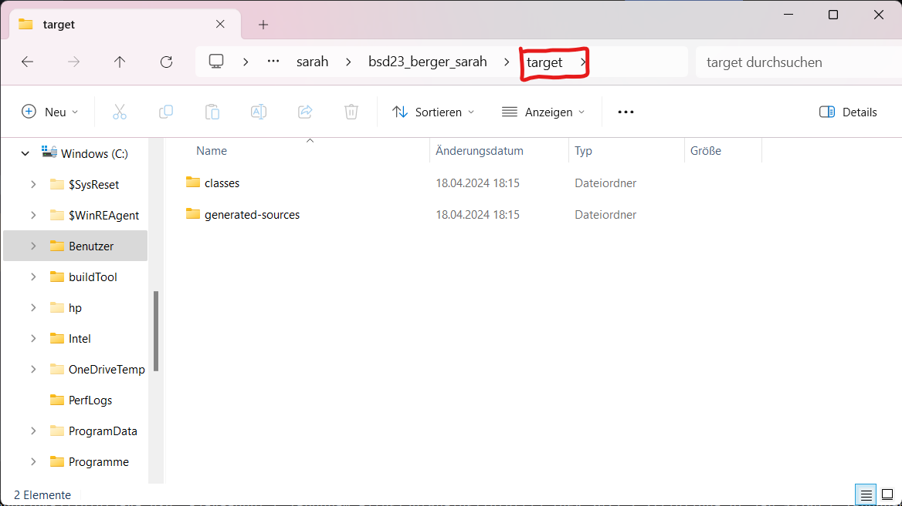
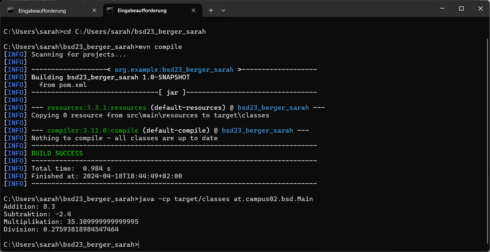

# Exercise3

## Versionen
### java
java version "21.0.1" 2023-10-17 LTS\
Java(TM) SE Runtime Environment (build 21.0.1+12-LTS-29)\
Java HotSpot(TM) 64-Bit Server VM (build 21.0.1+12-LTS-29, mixed mode, sharing)

### javac
javac 21.0.1

### mvn
Apache Maven 3.9.6 (bc0240f3c744dd6b6ec2920b3cd08dcc295161ae)\
Maven home: C:\Program Files\apache-maven-3.9.6-bin\apache-maven-3.9.6\
Java version: 21.0.1, vendor: Oracle Corporation, runtime: C:\Program Files\Java\jdk-21\
Default locale: de_DE, platform encoding: UTF-8\
OS name: "windows 11", version: "10.0", arch: "amd64", family: "windows"

## Arbeitsschritte
Als Erstes habe ich Maven heruntergeladen. Danach wurde JAVA_HOME und PATH Varbiable gesetzt. Hierführ wurde mit dem
Systemsumgebungsvariabeln gearbeitet. Danach wurde mit den befehlen:
>javac -version\
> java -version\
> mvn -v\

Nachgeschaut alles funktioniert hat mit den Umgebenungsvariabekn. Danach wurde ein neues Maven-Projekts in InteliJ erstellt.
Im zuge dessen wurde exercise3.md erstellt.

## Neuer Ordner

Im Screenshot ist zu erkennen, dass ein neuer Ordner namens "target" erstellt wurde, der rot eingekreist ist.
Zusätzlich dazu sind zwei Unterordner zu sehen. Im Ordner "generated-source" befindet sich ein weiterer Ordner namens "annotations".
Im Ordner "classes" ist eine Verzeichnisstruktur zu erkennen: Innerhalb dieses Ordners befindet sich der Ordner "at", in dem sich der Ordner "campus02" befindet.
Innerhalb des "campus02"-Ordners liegt wiederum der Ordner "bsd" (repräsentiert das von mir erzeugte Package).
Im Ordner "bsd" sind meine Java-Klassen (Main und Calculator) als kompilierte Dateien mit .class.

## Mvn compile - Main-Klasse ausführen

