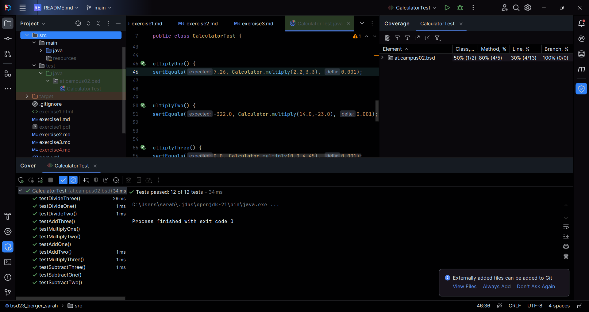
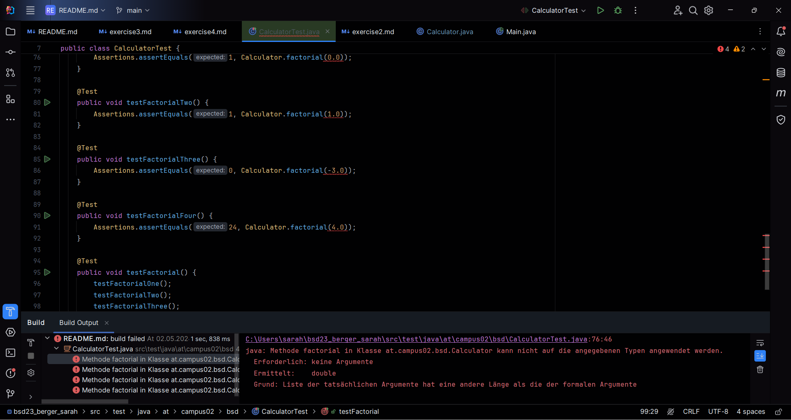
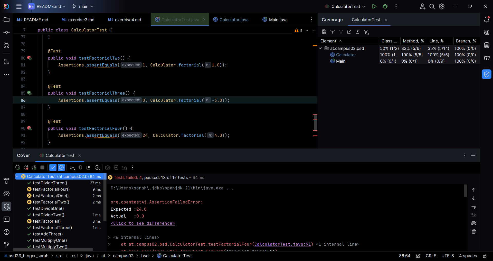
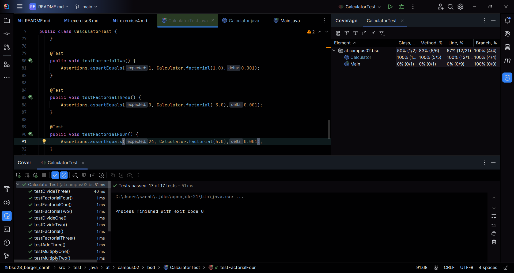

# Exercise4

## Testen
### Welche Testfälle wurden abgedeckt?
Es wurde abgedeckt das Rechnen mit Kommazahlen (double), die multiplikation mit 0.
Ebenso wurde die Multiplikation, die Addition und die Subtraktion mit minus Zahlen getestet.
Die division durch 0 wurde noch nicht getestet da diese noch nicht implementiert wurde.

## Test coverage

## TDD

## TDD-Zwischenstand
Wenn man noch nichts schreibt in die Methode außer return 0 und aber dann einen parameter der übergeben wird
reinschreibt, sieht es so aus:

## TDD-final
Wenn man die Methode schreibt sieht es so aus:

